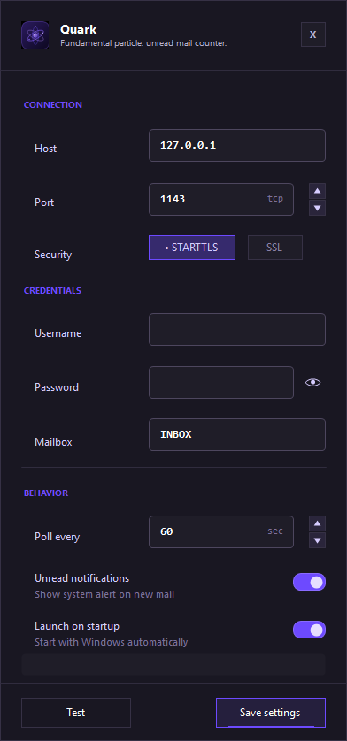

# Quark


Parts of this project were developed with AI assistance and human review.

Quark is a Windows tray unread counter for Proton Mail Bridge. It talks only to the local Bridge IMAP server and displays your inbox unread count in the system tray.



## Features

- Unread count badge in the Windows system tray.
- Opens the installed Proton Mail app from the tray when available.
- Optional start with Windows.
- Local Bridge-only IMAP access: `127.0.0.1`, `localhost`, `::1`.
- Bridge password encrypted with Windows DPAPI for the current user.

## Requirements

- Windows.
- Proton Mail Bridge installed and signed in.
- .NET 8 SDK if building from source.

## Setup

1. Start Proton Mail Bridge.
2. Open Quark.
3. Copy the IMAP username and password from Proton Mail Bridge.
4. Paste them into Quark.
5. Keep `127.0.0.1`, `1143`, and `STARTTLS` unless Bridge shows different local settings.
6. Click `Test`, then `Save settings`.

Use the Bridge IMAP password, not your normal Proton account password.

## Build

```powershell
dotnet restore .\Quark.sln
dotnet build .\Quark.sln
```

Run from source:

```powershell
dotnet run --project .\src\Quark.App\Quark.App.csproj
```

Build a self-contained Windows x64 release:

```powershell
.\scripts\publish-win-x64.ps1
```

Build the Inno Setup installer:

```powershell
.\scripts\build-installer.ps1
```

Requires Inno Setup 7. Installer output is written to `dist\`.

## Security

- Quark only requests `STATUS INBOX (UNSEEN)`.
- Quark rejects non-loopback IMAP hosts.
- Settings are stored at `%APPDATA%\Quark\settings.json`.
- The Bridge password is saved as `ProtectedPassword` using Windows DPAPI.
- Quark is not affiliated with Proton AG.

## Disclaimer

Quark is an unofficial utility for Proton Mail Bridge. It is provided as-is, without warranty or liability, under the MIT License. Use it at your own risk.

## License

MIT. See [LICENSE](LICENSE).
